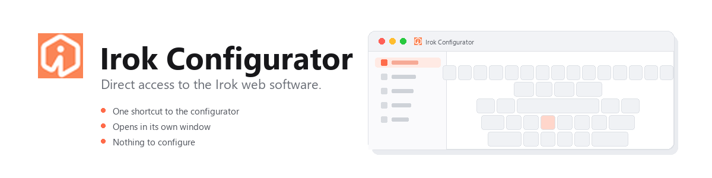

<div align="center">
  
</div>

<div align="center">

[](https://github.com/zxkodas/irok-configurator/releases/latest)
[](https://github.com/zxkodas/irok-configurator/actions/workflows/build.yml)
[](LICENSE)
[](https://learn.microsoft.com/en-us/windows/release-health/windows-11-release-information)
[](https://github.com/zxkodas/irok-configurator/releases/latest)

</div>

# Irok Configurator

A launcher for the [Irok web software](https://hid.irok.cn).

## What it does

Like a most peripheral brands now, Irok ships a single web-based option instead
of an installable program. That saves resources and is practical compared to an
installer, but it costs you in the day-to-day: to adjust something you open a
browser, find the page, connect your keyboard, and change what you want to change
This turns that into one shortcut on your Start menu and your Desktop, which opens the
configurator in a window of its own. No need to open a new browser tab

It holds no keyboard settings and never sends anything to your keyboard. Irok's
site does all of that, and this only gets you there.

### What it runs

There's no interface of its own. When you open it, it looks for a browser you
already have — Edge, Chrome, Brave, Opera or Vivaldi, in that order — and asks it
to open the Irok page in a dedicated window, without tabs or an address bar.

It also hands that window its own browser profile, kept in a separate folder.
That's what keeps extensions like Dark Reader from changing how the configurator
looks. You can change the browser order, or turn the separate profile off, in
`config.txt`. See **Options**.

### Why I made it

I use Firefox, and sadly, Irok's software doesn't support it. It reaches your keyboard over **WebHID**, an API that
only Chromium browsers implement, so it can't run in Firefox. Every time I wanted
to switch a profile, the routine was: open Chrome, navigate, make the change, close
it again. A few times a day, and it added up. I wanted it to behave like a normal app, so I made one.

If you're already on a compatible browser, this saves fewer clicks than it did for
me, but it makes you feel the software more integrated to your system (without it necesarrily being)

## Install

Download the `.zip` from the [latest release](https://github.com/zxkodas/irok-configurator/releases/latest)
and extract it. You'll get a single file called `IrokConfigurator.exe`.

Double-click it. That's the whole installation. It copies itself into your user
folder, adds a Start menu entry, and opens the configurator.

**Windows will probably warn you.** You'll get a blue window saying *Windows
protected your PC* and offering *More info*. Click **More info**, then **Run
anyway**.

That warning is expected. Windows shows it for any program that isn't signed with
a paid certificate, and this one isn't, because signing costs money that a free
open-source tool doesn't have. Nothing is wrong with the file. If you'd rather
check before you run it, the release also includes a `.sha256.txt` — compare it
against the zip and you're looking at the same build that came out of this
repository.

## Uninstall

Open Windows Settings, go to **Apps**, and find **Irok Configurator** in the list.
On Windows 11 it's under *Installed apps*; on Windows 10 it's *Apps & features*.
Click it and choose Uninstall.

It removes the launcher, its icon, and its separate browser profile. It leaves
your regular browser profile completely untouched.

If you'd rather do it from a terminal, the launcher cleans up after itself:

```
IrokConfigurator.exe --uninstall
```

## First launch

You'll get the browser's welcome screen. Dismiss it.

Then it asks you to pick your keyboard. Do that. The browser remembers the choice
from then on, so you only see this once.

**You won't have your old profiles.** Profiles live in the browser that created
them, and this launcher runs the configurator in its own profile so extensions
can't get in the way. A fresh profile starts empty.

If you've already built profiles somewhere else, they're still there. Open the
configurator in that other browser once, use its export function to save them to a
file, then import that file from the launcher. Everything shows up where you left
it, and it stays from then on.

## Options

Settings live in a plain text file:

```
%LOCALAPPDATA%\Programs\IrokConfigurator\config.txt
```

| Key | Meaning |
| --- | --- |
| `Url` | Page to open. Update if Irok moves their site. |
| `Preferred` | Browser to try first: `edge`, `chrome`, `brave`, `opera`, `vivaldi`. |
| `SharedProfile` | `true` uses your normal browser profile. Your existing profiles show up without importing, but your extensions then apply to the configurator too. |
| `DesktopShortcut` | `true` or `false`. |

## Notes

- The Irok web driver is **wired only**, and wants the keyboard on its own USB
  port rather than through an unpowered hub.
- If the configurator ever looks broken, check whether the same page works in a
  normal browser window. That tells you whether it's Irok's site or this launcher.

## Building

Needs only Windows. No Visual Studio, no packages.

```powershell
powershell -ExecutionPolicy Bypass -File .\build.ps1
```

## Legal

Unofficial community project. Not affiliated with, endorsed by, or supported by
Irok or KBDfans. All trademarks belong to their owners. The configurator is served
by Irok at [hid.irok.cn](https://hid.irok.cn); this project only opens it.
